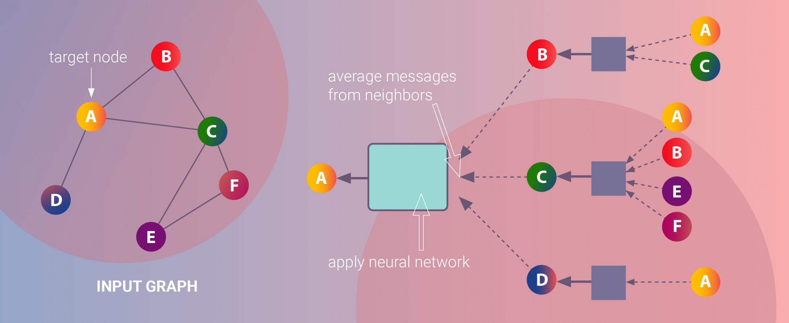

# Graph Convolutional Network
Machine learning on graphs is a difficult task due to the highly complex, but also informative graph structure.Graph Convolutional Networks (GCNs), a powerful type of 
neural network designed to work directly on graphs and leverage their structural information. 
In these notebook we illustrate how information is propagated through the hidden layers of a GCN how the GCN aggregates information from the previous layers and how this mechanism produces useful feature representations of nodes in graphs.

## What is a Graph Convolutional Network?
GCNs are a very powerful neural network architecture for machine learning on graphs. In fact, they are so powerful that even a randomly initiated 2-layer GCN can produce useful feature representations of nodes in networks.
The figure below illustrates a 2-dimensional representation of each node in a network produced by such a GCN.
Notice that the relative nearness of nodes in the network is preserved in the 2-dimensional representation even without any training.

More formally, a graph convolutional network (GCN) is a neural network that operates on graphs. Given a graph G = (V, E), a GCN takes as input

* an input feature matrix N × F⁰ feature matrix, X, where N is the number of nodes and F⁰ is the number of input features for each node, and
* an N × N matrix representation of the graph structure such as the adjacency matrix A of G.

A hidden layer in the GCN can thus be written as Hⁱ = f(Hⁱ⁻¹, A)) where H⁰ = X and f is a propagation.Each layer Hⁱ corresponds to an N × Fⁱ feature matrix where each row is a feature representation of a node. At each layer, these features are aggregated to form the next layer’s features using the propagation rule f. In this way, features become increasingly more abstract at each consecutive layer. In this framework, variants of GCN differ only in the choice of propagation rule f.

## A simple working of GCN

## Related links
* https://towardsdatascience.com/graph-embeddings-how-nodes-get-mapped-to-vectors-2e12549457ed
